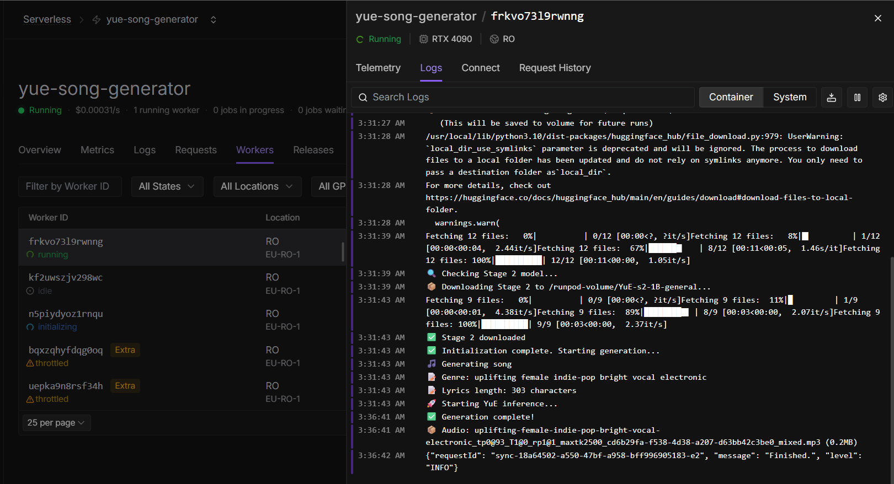

<div align="center">
  
  
  # TuneTools
  
  **Compose personalized songs from your daily context**
  
  Transform news, weather, and calendar events into unique musical experiences
</div>

---

TuneTools is a prototype pipeline that:

- extracts context (news, weather, calendar)
- generates a music specification and lyrics via an LLM
- generate image for the song
- formats inputs for the YuE music pipeline
- runs YuE inference (stage1 -> stage2 -> upsampler) to produce audio

This project was created for hackathon use (Kiroween / Frankenstein category) — see the **Kiroween Submission** section below for requirements about including Kiro artifacts.

**Quick Overview**

- **Purpose:** Generate daily, context-aware music (news + weather + calendar -> short song)
- **Inputs:** News articles, weather data, calendar events, user preferences
- **Core components:** LLM-based spec/lyrics generator, YuE inference glue, RunPod-friendly handler

**Project Structure**

```
TuneTools/
├── src/
│   ├── frontend/         # React + TypeScript frontend
│   └── backend/          # FastAPI backend
├── supabase/             # Database schema and migrations
│   ├── migrations/       # SQL migration files
│   └── config.toml       # Supabase configuration
├── scripts/              # Utility scripts
│   └── create_vinyl_disk.py
├── tests/                # Test scripts
│   ├── weather_test.py
│   ├── news_test.py
│   └── runpod_severless_ep/
├── docs/                 # Documentation
├── images/               # Project assets
├── .env                  # Environment variables
├── requirements.txt      # Python dependencies
└── README.md             # This file
```

**Important Files**

- `tests/runpod_severless_ep/handler.py`: RunPod handler that lazily downloads models and runs YuE
- `tests/runpod_severless_ep/test_endpoint.py`: example client to call the RunPod endpoint
- `tests/weather_test.py`: weather API integration test
- `tests/news_test.py`: news API integration test
- `scripts/create_vinyl_disk.py`: vinyl disk image generator
- `docs/`: notes about calendar API, prompt guidelines, required models

**Note about models**: The repo expects YuE models (stage1, stage2, upsampler). See `docs/Yue_Models.md` for recommended models and sizes.

**Security / Secrets**

- Keep API keys out of the repo. Use a local `.env` file or CI secrets for `RUNPOD_API_KEY`, `ENDPOINT_ID`, and other credentials.

**How it works (high level)**

1. Collect context: calendar events (Google Calendar), current weather, and top news headlines.
2. Send context to an LLM to produce:
   - a 5-component genre tag for YuE (genre, instrument, mood, gender, timbre)
   - structured lyrics (verse/chorus)
3. Save `genre.txt` and `lyrics.txt` and run the YuE inference pipeline to synthesize audio.
4. Return the generated audio (Base64) from the serverless handler.
5. generate image using gemini banana for the song.

**Running locally (developer)**

- Create a Python virtual environment and install dependencies (add packages as needed):

`python -m venv .venv`

`.\.venv\Scripts\Activate.ps1`

`pip install -r requirements.txt` # if you add one

- To test the RunPod example client, set up a `.env` with `RUNPOD_API_KEY` and `ENDPOINT_ID` and run:

`python tests/runpod_severless_ep/test_endpoint.py`

Note: First run will download models (large) when the handler is called.

**RunPod handler (notes)**

- The handler located at `tests/runpod_severless_ep/handler.py` lazily downloads models to `/runpod-volume` (if available) or `/tmp/models` and then runs `infer.py` inside `/app/YuE/inference`.
- The handler encodes audio to Base64 and returns it in the response. See the example client in `test_endpoint.py` for usage.

## How Songs Are Generated with YuE on RunPod

TuneTools uses the **YuE (Music Generation)** model running on **RunPod serverless infrastructure** to generate songs. Here's the complete pipeline:

### Architecture Overview

```
User Request → Backend API → RunPod Serverless → YuE Model → Generated Audio
```

### YuE Model Pipeline

YuE is a multi-stage music generation model that requires three components:

1. **Stage 1: YuE-s1-7B-anneal-en-cot** (~12GB)
   - Generates initial music representation from genre tags and lyrics
   - Chain-of-Thought reasoning for music composition

2. **Stage 2: YuE-s2-1B-general** (~4GB)
   - Converts representation to audio tokens
   - Handles melody and harmony generation

3. **Upsampler: YuE-upsampler** (~2.5GB)
   - Enhances audio quality
   - Increases sample rate for better fidelity

**Total Model Size:** ~18.5 GB

### Model Download Process

On first run, the RunPod handler automatically downloads all required models:

<div align="center">
  
  <p><em>Models are downloaded once and cached for subsequent runs</em></p>
</div>

**Download Strategy:**
- **Persistent Storage:** Models are saved to `/runpod-volume` if a network volume is mounted
- **Ephemeral Storage:** Falls back to `/tmp/models` for single-worker instances
- **Lazy Loading:** Models download only on first request, not at container startup
- **Caching:** Subsequent requests reuse cached models (7-minute generation vs 12-minute first run)

### Generation Parameters

The handler calls YuE with optimized parameters:

```python
python infer.py \
  --stage1_model /path/to/YuE-s1-7B-anneal-en-cot \
  --stage2_model /path/to/YuE-s2-1B-general \
  --max_new_tokens 4000 \          # Increased for 60-second songs
  --run_n_segments 2 \              # Number of generation segments
  --repetition_penalty 1.1 \        # Prevents repetitive patterns
  --genre_txt /tmp/genre.txt \      # 5-component genre tags
  --lyrics_txt /tmp/lyrics.txt \    # Structured lyrics (verse + chorus)
  --output_dir /tmp/output
```

### Performance Metrics

| Metric | First Run (Cold Start) | Subsequent Runs (Warm) |
|--------|----------------------|----------------------|
| Model Download | ~10 minutes | 0 seconds (cached) |
| Audio Generation | ~7 minutes | ~7 minutes |
| **Total Time** | **~12 minutes** | **~7 minutes** |
| **Cost (RTX 4090)** | ~$0.23 | ~$0.09 |

### RunPod Configuration

**Recommended Setup:**
- **GPU:** RTX 4090 or equivalent
- **Container Disk:** 40GB minimum (for model downloads)
- **Network Volume:** Optional but recommended for persistent caching
- **Execution Timeout:** 900 seconds (15 minutes)
- **Idle Timeout:** 90 seconds (keeps workers warm)
- **Region:** EU-RO-1 or closest to your users

### Input Format

**Genre Tags** (5 components, space-separated):
```
calm female jazz piano smooth vocal acoustic
```

**Lyrics** (structured with sections):
```
[verse]
Scattered clouds drift in the sky so gray
Laid off from Meta, still searching today
Logitech shines, on the Best in Business list
Meeting with Elisa, time to persist

[chorus]
Keep pushing forward, don't lose your stride
Keep pushing forward, with hope as your guide
New opportunities, just over the hill
Keep pushing forward, your dreams to fulfill
```

### Output

- **Format:** MP3 audio file
- **Duration:** ~60 seconds (verse + chorus)
- **Quality:** 44.1kHz sample rate after upsampling
- **Size:** ~0.4-0.5 MB
- **Encoding:** Base64 for API transport

For more details on YuE models and parameters, see `docs/Yue_Models.md` and `docs/valid_arguments_YuE.md`.

## Image Generation (Gemini)

TuneTools can generate custom album artwork using Google's Gemini AI:

- **Script**: `scripts/generate_image.py` (template)
- **Environment**: Set `GEMINI_API_KEY` or `GOOGLE_API_KEY` before running
- **Example (PowerShell)**:

```powershell
setx GEMINI_API_KEY "your_api_key_here"
.\.venv\Scripts\Activate.ps1
python scripts\generate_image.py --title "Morning Anthem" --genre "uplifting female indie-pop bright vocal" --lyrics_file sample_lyrics.txt --out cover.png
```

**Note**: The script contains a placeholder for the actual Gemini call. Replace `generate_image_from_gemini` with your preferred Gemini SDK/REST implementation.

**Kiroween / Hackathon Submission (Frankenstein category)**

- **Requirement**: Include a `/.kiro` directory at the repository root containing Kiro specs, steering docs, vibe-coding transcripts, and hook code. Do NOT add `/.kiro` or its subfolders to `.gitignore`.
- **What to submit**:
  - Public repo URL with OSI-approved license
  - Live/demo URL (if available)
  - A 3-minute public demo video (YouTube/Vimeo)
  - Identify category (Frankenstein) and list Kiro features used (vibe coding, hooks, steering docs, MCP)
- **Suggested repo layout for submission**:
  - `/.kiro/` — Kiro specs and artifacts
  - `docs/kiro/` — written explanation of Kiro usage
  - `demo/` — demo scripts or generated outputs

Failure to include `/.kiro` may disqualify the submission.

---

**Last updated**: Nov 22, 2025
